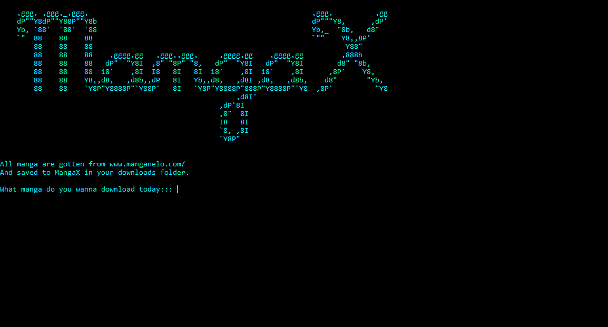
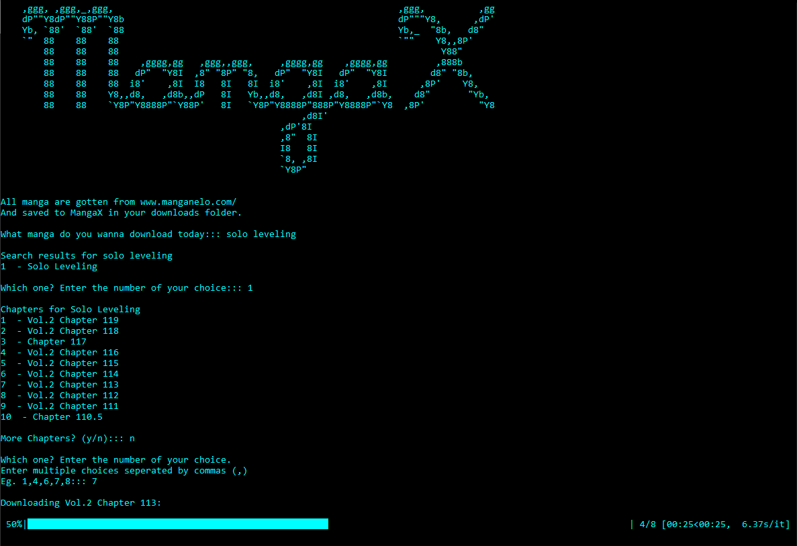

# MangaX
[](https://python.org)

Version 1 of [MangaX](https://github.com/LordGhostX/MangaX) which is a CLI tool for downloading manga.

All manga are gotten from [manganelo.com](https://manganelo.com)

## 📸 Screenshots



## Notes
* Share with your friends

## Supported Websites
* [manganelo.com](https://manganelo.com)

## 💻 Requirements
* Any Operating System (ie. MacOS X, Linux, Windows)
* Any IDE with python installed on your system(ie. Pycharm, VSCode etc)
* A little knowledge of Python and Web scrapping
* Hands to code 🤓
* A brain to think 🤓

## Getting started/Usage Guide

#### 1. Clone the repo

```sh
$ git clone https://github.com/UcGeorge/MangaX.git
$ cd MangaX
```

#### 2. [Setup and activate a virtual environment](https://programwithus.com/learn-to-code/Pip-and-virtualenv-on-Windows/)

#### 3. Get requirements

```sh
$ pip install -r requirements.txt
```

#### 4. Running the application

```sh
$ python mangax.py
```
```sh
$ python mangax.py "solo leveling"
```

## :heart: Found this project useful?
If you found this project useful or you like what you see, then please consider giving it a :star: on Github and sharing it with your friends via social media.

## 🐛 Bugs/Request
Encounter any problem(s)? feel free to open an issue. If you feel you could make something better, please raise a ticket on Github and I'll look into it. Pull request are also welcome.

## ⭐️ License
<a href="https://github.com/UcGeorge/MangaX/blob/master/LICENSE">MIT LICENSE</a>

## 🤓 Developer(s)
* **UcGeorge**
